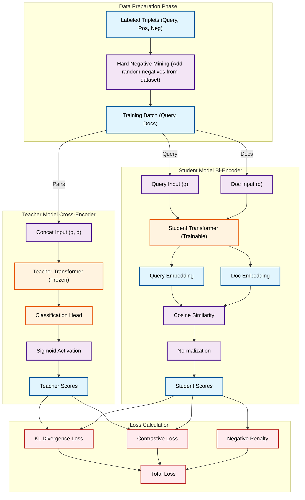

# Cross-Encoder → Bi-Encoder 지식 증류 파이프라인




## 개요
Cross-Encoder Teacher의 지식을 Bi-Encoder Student에게 전달하는 지식 증류 시스템
- **1단계**: Cross-Encoder Teacher 학습 (관련성 점수 학습)
- **2단계**: Bi-Encoder Student 학습 (코사인 유사도 출력)
- **최종 목표**: 효율적인 Bi-Encoder + 정확한 코사인 유사도

## 특징
- **지식 증류**: Cross-Encoder의 정교한 판단 능력을 Bi-Encoder에 전달
- **코사인 유사도 출력**: 수학적으로 정확한 코사인 유사도 계산
- **효율성**: Bi-Encoder의 빠른 검색 + Cross-Encoder 수준의 성능
- **LoRA**: Parameter-efficient fine-tuning으로 효율적인 학습

## 구조
```
finetuning_embedding/
├── train_teacher_model.py              # Teacher 모델 학습 (관련성 점수)
├── train_distillation_pipeline.py      # 통합 지식 증류 파이프라인 (권장)
├── evaluate_final_model.py             # 최종 모델 평가
├── realtime_monitor.py                 # 실시간 학습 모니터링 및 자동 복구
├── models/                             # 학습된 모델들
│   ├── cross_encoder_teacher/          # Teacher 모델
│   ├── bi_encoder_distilled/           # Student 모델 (단계별)
│   └── bi_encoder_distilled_improved/   # Student 모델 (통합, 권장)
├── evaluation_results/                 # 평가 결과
│   ├── bi_encoder_distilled/
│   ├── bi_encoder_distilled_improved/
│   └── final_model_normalized/
├── preprocessed/                       # 전처리된 데이터
│   ├── supervised_only/
│   └── supervised_with_detailed/
└── README.md                           # 이 파일
```

## 최종 출력: 정규화된 코사인 유사도 (0~1)

**최종 모델의 출력**:
- **원본 코사인 유사도**: -1 ~ 1 범위
- **정규화된 점수**: 0 ~ 1 범위 (성능 평가용)
- **정규화 공식**: `normalized_score = (cosine_similarity + 1) / 2`

**정규화의 장점**:
- 성능 평가 시 직관적인 0~1 범위
- Cross-Encoder의 relevance score(0~1)와 동일한 범위로 비교 가능
- 임계값 설정이 용이 (예: 0.5 이상이면 관련성 높음)

## 사용법

### 빠른 테스트 (결과 확인용)

빠르게 결과를 확인하고 싶다면 다음 설정을 사용하세요:

#### 1단계: Teacher 모델 학습 (빠른 테스트)
```bash
python train_teacher_model.py \
    --data_version supervised_only \
    --output_dir ./models/cross_encoder_teacher_quick \
    --epochs 1 \
    --batch_size 32 \
    --lr 2e-5 \
    --use_lora \
    --lora_r 16 \
    --lora_alpha 32 \
    --max_samples 2000
```

#### 2단계: Student 모델 학습 (빠른 테스트)
```bash
python train_distillation_pipeline.py \
    --teacher_path ./models/cross_encoder_teacher_quick \
    --student_name intfloat/multilingual-e5-large-instruct \
    --data_version supervised_only \
    --output_dir ./models/bi_encoder_distilled_quick \
    --epochs 1 \
    --batch_size 16 \
    --lr 2e-5 \
    --K 4 \
    --tau 0.2 \
    --contrastive_weight 0.3 \
    --negative_penalty_weight 0.4 \
    --use_lora \
    --max_len 128 \
    --max_samples 2000
```

**참고**: Teacher 모델의 LoRA 설정(`lora_r=16`)은 자동으로 로드되므로 Student 학습 시 별도로 지정할 필요가 없습니다.

**빠른 테스트 설정 특징**:
- Epochs: 1 (전체 학습: 3)
- Batch size: 증가 (32/16)
- K: 4 (전체 학습: 8)
- LoRA rank: 16 (전체 학습: 32)
- Max length: 128 (전체 학습: 256)
- **Max samples: 2000** (전체: 14,379개) - 약 7배 빠름
- 예상 시간: 약 **15-30분** (GPU 기준, H200)

---

### 전체 학습 (최종 모델)

### 1단계: Teacher 모델 학습
```bash
python train_teacher_model.py \
    --data_version supervised_only \
    --output_dir ./models/cross_encoder_teacher \
    --epochs 3 \
    --batch_size 16 \
    --lr 2e-5 \
    --use_lora \
    --lora_r 32 \
    --lora_alpha 64 \
    --lora_dropout 0.1
```

**참고**: 
- `--lora_dropout`은 선택사항이며 기본값은 0.1입니다.
- Teacher 모델 저장 시 LoRA 설정(`lora_config.json`)이 자동으로 저장됩니다.

### 2단계: Student 모델 학습 (지식 증류) - 권장
```bash
python train_distillation_pipeline.py \
    --teacher_path ./models/cross_encoder_teacher \
    --student_name intfloat/multilingual-e5-large-instruct \
    --data_version supervised_only \
    --output_dir ./models/bi_encoder_distilled_improved \
    --epochs 3 \
    --batch_size 4 \
    --lr 2e-5 \
    --K 8 \
    --tau 0.2 \
    --contrastive_weight 0.3 \
    --negative_penalty_weight 0.4 \
    --use_lora \
    --lora_r 32 \
    --lora_alpha 64 \
    --lora_dropout 0.1
```

**주요 파라미터 설명**:
- `--teacher_path`: **필수** - Teacher Cross-Encoder 모델 경로
- `--output_dir`: **필수** - Student 모델 저장 경로
- `--contrastive_weight`: Positive와 Negative 간 margin 확보를 위한 가중치 (기본값: 0.3)
- `--negative_penalty_weight`: Negative 점수를 낮추기 위한 페널티 가중치 (기본값: 0.4)
- `--K`: 쿼리당 후보 문서 수 (기본값: 16, README 예제는 8로 설정)
- `--tau`: Temperature scaling (기본값: 0.2)
- `--batch_size`: 배치 크기 (기본값: 16, GPU 메모리에 따라 조정 권장)
- `--use_lora`: LoRA 사용 (action flag, 지정 시 사용)
- `--lora_r`, `--lora_alpha`, `--lora_dropout`: Student 모델의 LoRA 설정 (Teacher는 자동으로 로드됨)

**중요**: 
- Teacher 모델의 LoRA 설정은 자동으로 로드됩니다 (`lora_config.json` 파일 사용)
- Student 학습 시 `--lora_r` 등의 파라미터는 Student 모델용이며, Teacher는 저장된 설정을 사용합니다
- GPU 메모리가 부족한 경우 `--batch_size`를 2~4로 낮추고, `--K`를 4~8로 낮추세요
- GPU 메모리 에러(`NVML_SUCCESS`, `out of memory`) 발생 시:
  - `--batch_size`를 더 낮추기 (예: 4 → 2)
  - `--K`를 더 낮추기 (예: 4 → 2)
  - `--max_len`을 더 낮추기 (예: 128 → 64)
  - 코드는 자동으로 GPU 캐시를 정리하고 에러 발생 배치를 건너뜁니다

### 3단계: 모델 평가
```bash
python evaluate_final_model.py \
    --model_path ./models/bi_encoder_distilled_improved \
    --test_data ./preprocessed/supervised_only/test.csv \
    --output_dir ./evaluation_results/final_model_normalized \
    --batch_size 8
```

### 실시간 모니터링 (선택사항)
```bash
python realtime_monitor.py
```
- 학습 프로세스 상태 실시간 확인
- 에러 발생 시 자동 감지 및 복구
- 학습 완료 시 평가 자동 실행

## 지식 증류 파이프라인 설명

### 1단계: Cross-Encoder Teacher
- **목적**: 정교한 관련성 판단 능력 학습
- **방식**: Query와 Passage를 함께 인코딩 → 관련성 점수 계산
- **Loss**: BCEWithLogitsLoss (Binary Classification)
- **출력**: 관련성 점수 (0 ~ 1)

### 2단계: Bi-Encoder Student
- **목적**: Cross-Encoder의 지식을 코사인 유사도로 학습
- **방식**: Query와 Passage를 별도로 인코딩 → 코사인 유사도 계산
- **Loss**: 
  - Listwise KL Divergence (지식 증류)
  - Contrastive Loss (Positive-Negative margin 확보)
  - Negative Penalty (Negative 점수 낮추기)
- **출력**: 코사인 유사도 (-1 ~ 1), 정규화된 점수 (0 ~ 1)

## 지식 증류 메커니즘

### Teacher (Cross-Encoder)
1. Query와 Passage를 결합하여 인코딩
2. 관련성 점수 계산 (0 ~ 1)
3. Soft label 생성 (Temperature scaling)

### Student (Bi-Encoder)
1. Query와 Passage를 별도로 인코딩
2. 코사인 유사도 계산 (-1 ~ 1)
3. Teacher의 soft label과 KL Divergence로 학습

## 평가 메트릭
- **정규화된 코사인 유사도**: Positive/Negative 쌍의 유사도 분포 (0~1 범위)
- **Margin**: Positive 평균 점수 - Negative 평균 점수
- **Uniformity**: 점수 분포의 균일성 (분산)
- **샘플 테스트**: 실제 쿼리-문서 쌍의 유사도 확인

## 출력 파일

### 모델 파일
- `models/cross_encoder_teacher/`: Teacher Cross-Encoder 모델
  - `best_model.pt`: 모델 가중치
  - `lora_config.json`: LoRA 설정 (자동 저장됨)
- `models/bi_encoder_distilled_improved/`: 최종 Bi-Encoder Student 모델 (권장)

### 평가 결과
- `evaluation_results/*/bi_encoder_evaluation_results.json`: 평가 결과 (JSON)
- `evaluation_results/*/bi_encoder_evaluation_analysis.png`: 분석 그래프 (시각화)

## 최종 모델 특징
- **Bi-Encoder 구조**: 효율적인 검색 가능
- **정규화된 코사인 유사도**: 0~1 범위의 직관적인 점수
- **Cross-Encoder 지식**: Teacher 모델의 정교한 판단 능력 학습
- **높은 성능**: Positive/Negative 명확한 구분
- **개선된 Loss 함수**: Contrastive Loss와 Negative Penalty로 Negative 점수 최적화
  - Negative 평균 점수: 0.15 이하 목표
  - Positive-Negative Margin: 0.7 이상 목표

## Loss 함수 개선 사항

### Contrastive Loss
- Positive와 Negative 간의 margin을 최소 0.7 이상 유지
- 각 쿼리별로 Positive 평균과 Negative 평균의 차이를 최대화

### Negative Penalty
- Negative 점수가 0.15 이하가 되도록 강제
- 전체 배치 및 각 쿼리별로 Negative 점수 페널티 적용
- 기본 가중치: 0.4

이를 통해 Negative 점수를 낮추고 Positive와의 구분을 명확히 합니다.
