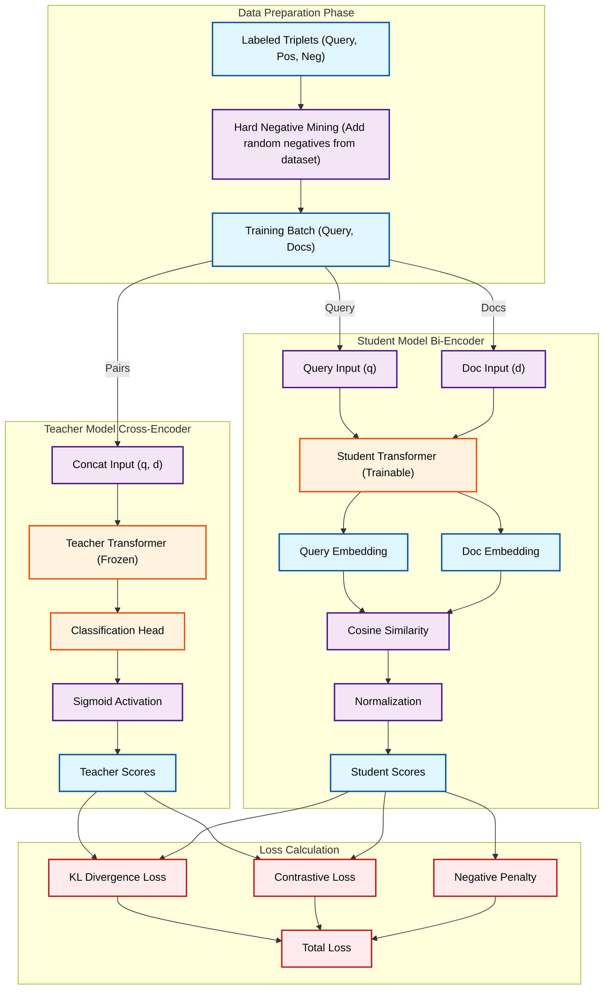

# Knowledge Distillation Architecture Diagram

This document contains a detailed Mermaid diagram representing the Cross-Encoder to Bi-Encoder Knowledge Distillation architecture.

```mermaid
graph TD
    %% Styles
    classDef data fill:#e1f5fe,stroke:#01579b,stroke-width:2px,color:black;
    classDef model fill:#fff3e0,stroke:#e65100,stroke-width:2px,color:black;
    classDef process fill:#f3e5f5,stroke:#4a148c,stroke-width:2px,color:black;
    classDef loss fill:#ffebee,stroke:#b71c1c,stroke-width:2px,color:black;

    %% Data Preparation
    subgraph DataPrep [Data Preparation Phase]
        direction TB
        RawData["Labeled Triplets (Query, Pos, Neg)"]:::data
        HN_Mining["Hard Negative Mining (Add random negatives from dataset)"]:::process
        BatchData["Training Batch (Query, Docs)"]:::data
        
        RawData --> HN_Mining
        HN_Mining --> BatchData
    end

    %% Teacher Model
    subgraph Teacher [Teacher Model Cross-Encoder]
        direction TB
        T_Input["Concat Input (q, d)"]:::process
        T_Encoder["Teacher Transformer (Frozen)"]:::model
        T_Head["Classification Head"]:::model
        T_Sigmoid["Sigmoid Activation"]:::process
        T_Scores["Teacher Scores"]:::data
        
        BatchData -- Pairs --> T_Input
        T_Input --> T_Encoder
        T_Encoder --> T_Head
        T_Head --> T_Sigmoid
        T_Sigmoid --> T_Scores
    end

    %% Student Model
    subgraph Student [Student Model Bi-Encoder]
        direction TB
        S_Q_Input["Query Input (q)"]:::process
        S_D_Input["Doc Input (d)"]:::process
        S_Encoder["Student Transformer (Trainable)"]:::model
        
        S_Q_Emb["Query Embedding"]:::data
        S_D_Emb["Doc Embedding"]:::data
        
        S_CosSim["Cosine Similarity"]:::process
        S_Norm["Normalization"]:::process
        S_Scores["Student Scores"]:::data

        BatchData -- Query --> S_Q_Input
        BatchData -- Docs --> S_D_Input
        
        S_Q_Input --> S_Encoder
        S_D_Input --> S_Encoder
        
        S_Encoder --> S_Q_Emb
        S_Encoder --> S_D_Emb
        
        S_Q_Emb --> S_CosSim
        S_D_Emb --> S_CosSim
        S_CosSim --> S_Norm
        S_Norm --> S_Scores
    end

    %% Loss
    subgraph Loss [Loss Calculation]
        direction TB
        KL_Loss["KL Divergence Loss"]:::loss
        Contrastive_Loss["Contrastive Loss"]:::loss
        Neg_Penalty["Negative Penalty"]:::loss
        Total_Loss["Total Loss"]:::loss
    end

    T_Scores --> KL_Loss
    S_Scores --> KL_Loss
    
    T_Scores --> Contrastive_Loss
    S_Scores --> Contrastive_Loss
    S_Scores --> Neg_Penalty
    
    KL_Loss --> Total_Loss
    Contrastive_Loss --> Total_Loss
    Neg_Penalty --> Total_Loss
```
